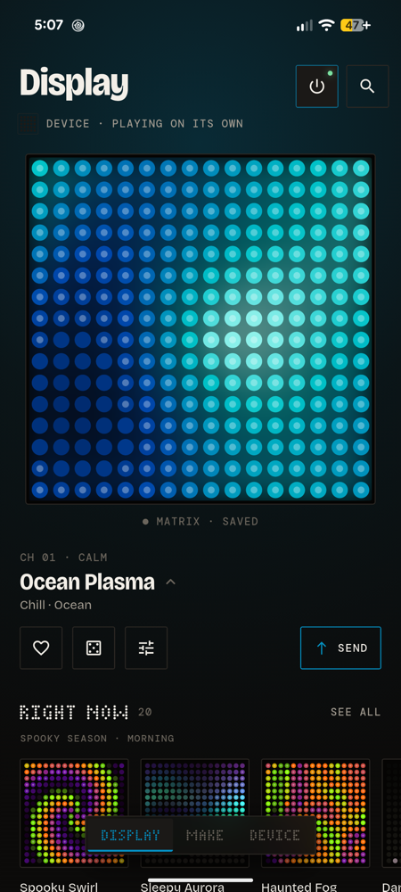
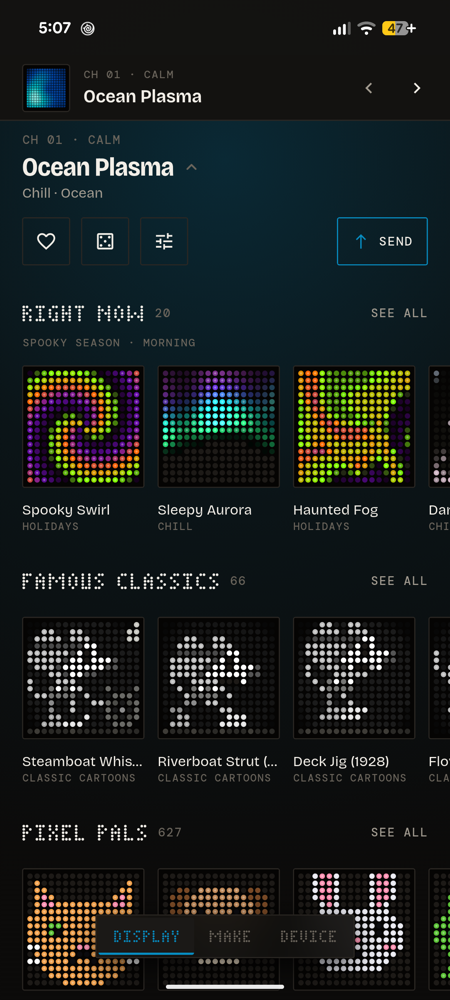
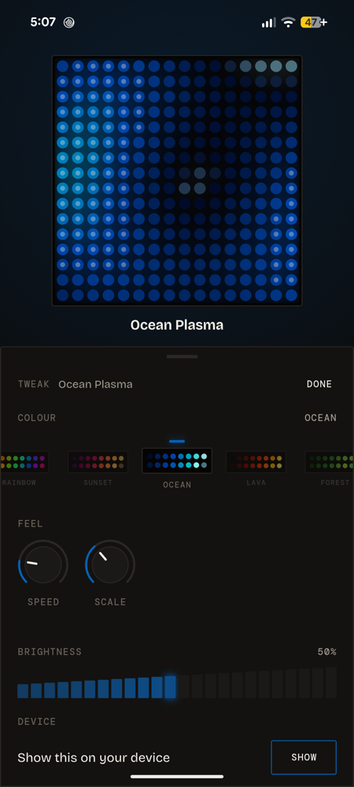
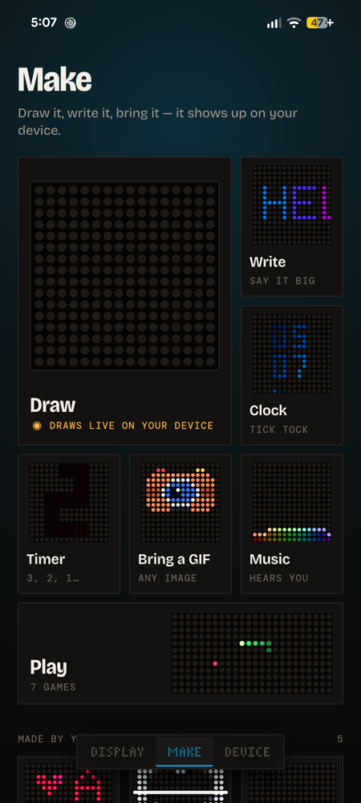
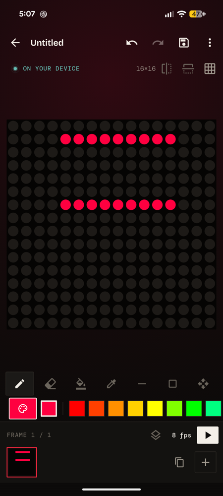
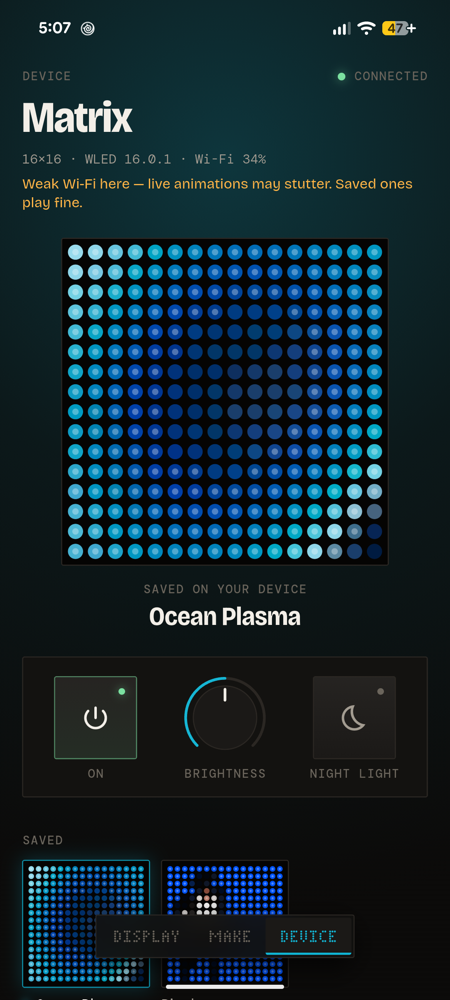

<p align="center">
  
</p>

<h1 align="center">Glyph</h1>

<p align="center">
  <b>Your matrix, alive.</b><br>
  A fast, beautiful app for WLED LED matrices — 1,163 animations, a pixel
  editor, text and clocks, GIF import, a music visualiser and games.
</p>

<p align="center">
  <a href="https://github.com/spandan-kumar/glyph/releases/latest"></a>
  <a href="LICENSE"></a>
  <a href="https://github.com/spandan-kumar/glyph/actions/workflows/ci.yml"></a>
  <a href="https://apps.obtainium.imranr.dev/redirect?r=obtainium://add/https://github.com/spandan-kumar/glyph"></a>
  <a href="https://discord.gg/9EeCFZAFvk"></a>
</p>

<p align="center">
  <a href="https://github.com/spandan-kumar/glyph/releases/latest"><b>Download the latest APK</b></a>
  ·
  <a href="docs/design/UX.md">Design</a>
  ·
  <a href="CONTRIBUTING.md">Contributing</a>
</p>

<p align="center">
  
</p>

Glyph renders everything on your phone and either **streams** it to the
matrix live or **sends** it onto the matrix so it keeps playing without the
phone. It works with any WLED controller, however little memory it has.

## Screenshots

| Display | Channels | Tweak |
|:---:|:---:|:---:|
|  |  |  |
| **Make** | **Draw** | **Device** |
|  |  |  |

## Features

**Display** — your matrix lives at the top of the screen as a glowing live
panel. Swipe it to flip through animations like TV channels, roll the dice
for a surprise, and tap **Send** to put an animation on the device. Tweak
colours and motion with a palette reel and rotary knobs; the whole app glows
with whatever is on your matrix.

- **1,163 animations** in 22 categories: 62 procedural effects (plasma, fire,
  aurora, reaction–diffusion, falling sand…), 313 original pixel-art sprites,
  and **Famous Classics** — public-domain characters and paintings such as the
  1928 Steamboat Willie mouse, Pinocchio, Alice, Dracula and The Starry Night.
- Seamless loops on the device, accurate colours (device gamma, true blacks,
  stable hues at low brightness).

**Make**
- **Draw** — frames, onion skin, mirror drawing, fill, shapes and undo; your
  strokes appear on the matrix as you draw.
- **Write**, **Clock** and **Timer** — hand-made pixel fonts; clocks keep the
  real time on the device with your phone off.
- **Bring a GIF** — any GIF, WebP or photo, cropped and tuned for LEDs.
- **Music** — nine visualisers driven by the microphone, with beat detection.
  Audio never leaves the phone.
- **Now Playing** — the cover of whatever your phone is playing (Spotify,
  YouTube Music, any player) with a progress bar, live on the matrix. Covers
  are never stored on the phone or the device.
- **Play** — Snake, Blocks, Brick Breaker, Pong, Flap, Racer and Invaders,
  with your phone as the controller.

**Device**
- Power, brightness and night light; **Saved** animations, **Shows**
  (playlists) and **Routines** (schedules) that run without your phone.
- The **Glyph intro** plays every time your device powers on.
- Storage alerts, multiple devices, a home-screen widget, and the full WLED
  settings inside the app.

## Install

Download the APK from the [latest release](https://github.com/spandan-kumar/glyph/releases/latest)
on an Android phone (7.0+, 64-bit ARM) and open it. It's for sideloading —
not yet on the Play Store. To get updates automatically, add it to
[Obtainium](https://apps.obtainium.imranr.dev/redirect?r=obtainium://add/https://github.com/spandan-kumar/glyph).
Each release lists the APK's SHA-256 next to it.

## What you need

- A WLED controller driving an LED matrix (developed on WLED 16.0.1, ESP32,
  16×16 WS2812B)
- The matrix set up in WLED under **Settings → 2D Configuration**
- Your phone on the same Wi-Fi

| Controller | Live streaming | Send to device |
|---|:---:|:---:|
| ESP32 / S2 / S3 / C3 on WLED 16+ | ✅ | ✅ |
| ESP32 on WLED 0.14–0.15 | ✅ | — built-in effects only |
| ESP8266 | ✅ | — no GIF player in WLED |

Glyph checks each controller when it connects and only offers what works.

**Works with** any WLED 2D matrix: WS2812B/SK6812 panels and HUB75 panels
(via WLED's ESP32_HUB75 builds), at whatever size you set in WLED's
**2D Configuration** — 8×8, 16×16, 32×8, 32×32, 64×32 and beyond. ESP8266
controllers stream live but can't hold sent animations.

## How it works

```
 Phone: render engine ──┬── Stream: DDP over UDP :4048, 40 fps ──────┐
 (one engine draws the  │                                            ├─► WLED ─► LEDs
  previews and the      └── Send: bake GIF → POST /upload →          │
  real LEDs)                Image effect → preset ───────────────────┘
```

- **Streaming** sends each frame with [DDP](https://kno.wled.ge/interfaces/ddp/),
  colour-corrected for the device.
- **Sending** bakes a seamless-looping GIF (shared palette, delta frames,
  typically 8–30 KB at 16×16), uploads it, verifies it and saves a WLED
  preset — the device keeps showing the animation live until the file is safe.
- The library is data: an effect id plus parameters and a palette, or a
  sprite, so new items can ship as a catalog file.

## Build from source

Requires Flutter 3.47+ (Dart 3.13) and the Android SDK.

```bash
flutter pub get
flutter test
flutter run
flutter build apk --release --split-per-abi --target-platform android-arm64
```

See [AGENTS.md](AGENTS.md) for the project layout, conventions, tools and how
to test against a real device, and [CONTRIBUTING.md](CONTRIBUTING.md) to add
an animation or send a pull request. Glyph is released under the
[MIT License](LICENSE).

## Community

- **Chat** — the [Glyph Discord](https://discord.gg/9EeCFZAFvk): help, ideas, beta builds
- **Questions and help** — [Discussions](https://github.com/spandan-kumar/glyph/discussions)
- **Show your setup** — photos and clips of your matrix in
  [Show and tell](https://github.com/spandan-kumar/glyph/discussions/categories/show-and-tell)
- **Bugs, animation and display requests** — use **Send feedback** in the
  app, or the [issue forms](https://github.com/spandan-kumar/glyph/issues/new/choose);
  👍 the requests you want most
- **What's next** — the [roadmap](docs/ROADMAP.md)
- **Contribute** — draw a sprite in a few minutes, see
  [CONTRIBUTING.md](CONTRIBUTING.md); everyone follows the
  [Code of Conduct](CODE_OF_CONDUCT.md)

## Content and credits

All effects and pixel art are original to this project; Famous Classics are
drawn from public-domain originals and carry their source notes. No code was
copied from WLED or other GPL/EUPL projects. Fonts: Bricolage Grotesque and
DM Mono (SIL OFL).

The code and original artwork are released under the [MIT License](LICENSE).

Glyph is not affiliated with the WLED project.
