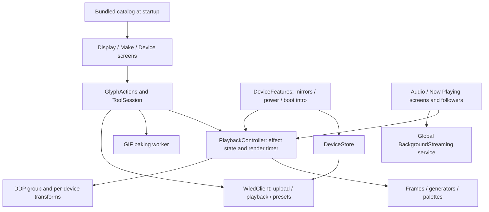

# Glyph architecture audit

7 October 2026 · `75656c4` · v1.3.1+6. Scope: the current application and the
future shape in [PLAN.md](PLAN.md) and [ROADMAP.md](ROADMAP.md).

## Assessment

Keep the rendering engine, frame model, generators, GIF encoder and WLED
protocol code. The important changes are around asynchronous device work,
playback ownership and catalog acceptance. Those boundaries need to hold
before notifications, refreshed cards, remote art and additional devices
can share the app.

Three current failure classes belong in the next bug bundle: stale results
after device switching, failed replacement Sends changing playback, and
concurrent boot/preset writes losing a user preset. Remote content has two
additional blockers, dormant because remote loading is disabled. Session
ownership and adapter boundaries are roadmap prerequisites.

This is an architecture/correctness audit, not a security scan. The findings
describe the audited commit; the implementation follow-up below records
changes included in v1.3.2. Confirmed findings use controlled fakes; code-traced
risks and future design gaps are labelled separately.

## Implementation follow-up, 7 October 2026

A1–A3 are included in v1.3.2 with regression coverage; physical QA remains
unverified:

- Device refreshes, manager lists and native-control completions check their
  selection generation before publishing. Clients are retained per host and
  closed on removal/disposal. Send checks selection, playback, stream and
  control generations before handoff; a late result cannot stop newer playback
  or mark a different device Saved.
- Replacement Sends upload a fresh filename, verify it, then switch playback
  and reuse the Saved ID. Cancellation before commit removes the new file and
  preserves the old look. Space checks budget the full replacement. Catalog
  matching recognises replacement filenames after reopening the app.
- Boot rewrites and preset saves/deletes share a host queue, including calls
  from different clients. Nested operations retain the lock; failed operations
  release it. JSON preset writes retain the existing 700 ms settling interval
  before releasing the queue. New Show IDs come from a fresh device read
  inside the operation rather than a cached view.

Cleanup deletes only files created by the current client that are no longer
playing or referenced by Saved items. Older files whose ownership cannot be
proved remain available in Storage. Replacement therefore needs extra free
space. Failures after committing playback can still leave partial state;
network loss prevents guaranteed rollback. The queue covers Glyph's writes,
not simultaneous external writers or other phones.

Regression coverage lives in `device_races_test.dart`, `send_safety_test.dart`,
`preset_mutation_test.dart` and `send_races_test.dart`, alongside the strengthened
WLED upload tests. A4–A8 remain future work; this change does not introduce the
notification coordinator, remote catalog delivery or additional adapters.

The next-release follow-up also implements #20–#24: collapsed Send,
persistent sharing frequency, Discord sharing, system-intro presentation and
exact GIF matching before re-sending. A previous Send's confirmation animation
cannot clear a newer operation's status. See [PLAN.md](PLAN.md) for behaviour
and release status.

Final combined verification: `flutter analyze` reports no issues; the full
suite passes 1,036 tests, with the live-device test skipped. Sixteen new tests
cover A1–A3, including successful and cancelled Sends; eleven more cover the
next-release changes. A pre-existing catalog test now awaits its update
callback instead of assuming 50 ms is enough.

## Foundations to preserve

- `lib/engine` and `lib/wled` have no Flutter imports. Rendering and encoding
  work in tools and workers independently of widgets.
- Streaming and device playback are distinct paths. DDP targets/groups own
  per-device layout and colour correction; GIFs retain a separate contract.
- HTTP clients and several services accept fakes. Boot planning separates
  pure decisions from I/O, making ordering failures reproducible.
- `frameTick` separates preview repainting from general state notifications.
  Generated catalog/sprite data have consistency checks.
- Remote cache replacement already uses a temporary file and rename.
  Extend that approach to accepting in-memory content.

## Findings

### A1. Late results overwrite the newly selected device

**High; confirmed current bug.** `DeviceStore.refresh()` captures a client
but publishes capabilities, information and saved metadata after awaiting
without checking that the client is still selected. Error/loading updates
are also unguarded. `DeviceManager.load()` publishes presets/files/schedules
before its final client comparison.

A delayed Alpha refresh, followed by selecting Beta, left the selected host
as Beta with Alpha's name and 16×16 dimensions. A second probe displayed an
Alpha-only preset while Beta was selected. The metadata path can persist
the wrong name/MAC and associate Alpha's colour configuration with Beta.

Related code-traced risk: Send captures Alpha's client, but completion stops
the current global stream and calls `refresh()` / `noteKept()` on the current
store. Switching to Beta or starting newer playback during upload can affect
the wrong session. Power rollback and preset completion need the same guard.

**Change:** capture a device/session handle containing host, client and
generation. Guard publication, failure rollback and playback handoff. Bind
Send cancellation to safe phases; late results must not stop newer playback.
Own client lifetime explicitly: selecting currently replaces the primary
client without closing it.

**Gate:** delayed successes/failures cannot alter another target's metadata,
colours, lists, power or error. Late Sends cannot mark another device as Saved
or stop newer playback. Selection/disposal release clients while respecting
in-flight operations.

Sources: [DeviceStore](../lib/app/devices.dart), lines 158–168, 213–247,
274–279, 311–324 and 352–362; [DeviceManager](../lib/features/device/device_manager.dart),
lines 112–168; [Send](../lib/ui/actions.dart), lines 135–183. The guarded
`_readState()` path is a useful existing precedent.

### A2. A failed replacement Send changes playback

**High; confirmed current bug.** `saveGifToDevice()` switches segment 0 to
Solid to release its playing filename before uploading the replacement.
The probe then failed the upload; Solid remained selected. This violates
the documented failed-Send contract. A live stream may temporarily cover
the change; without streaming the native effect change is directly visible.

**Change:** upload and verify a staging/versioned filename before committing
playback, reusing the existing Saved preset ID. Budget space for both files.
Retire only superseded app-owned files after commit. Report the actual phase
on failure and attempt recovery after commit; network loss can prevent rollback.

**Gate:** upload/verification failures preserve native state and the original
file; success reuses the preset; insufficient staging space fails before
changing playback. Test post-switch/preset failures separately.

Source: [WledClient](../lib/wled/wled_client.dart), lines 237–274 and 317–330.
The [existing failure test](../test/wled/wled_client_test.dart), lines
104–135, checks live/preset writes rather than the earlier Solid mutation.

### A3. Boot configuration can erase a concurrently saved preset

**High; confirmed with a fake preset store.** Boot installation and power-on
changes read `/presets.json`, modify that snapshot and upload the whole file.
Sends save presets through a separate command path. Automatic installation
runs asynchronously; the manager's local queue does not cover these writers.

The probe paused a power-on change after reading the file, saved user preset
42 through `saveCurrentAsPreset()`, then resumed the rewrite. Preset 42
disappeared. Firmware write timing affects the race window; physical
reproduction remains pending.

**Change:** serialize Glyph mutations per host across Send, boot setup,
Saved, Shows and Routines. Include firmware write settling/verification.
Minimize whole-file rewrites and re-read/merge before unavoidable ones.
A Glyph-only queue cannot protect against simultaneous WLED web UI or Home
Assistant writes; do not promise transactional ownership of external changes.

**Gate:** concurrent Glyph operations retain unrelated presets, avoid duplicate
slot allocation and release the queue after failure. Verify asynchronous
firmware saves on the controller before release.

Sources: [boot writes](../lib/features/device/boot_intro.dart), lines 132–170;
[background installation](../lib/features/device/device_features.dart), lines
91–126; [preset save](../lib/wled/wled_client.dart), lines 220–232;
[manager queue](../lib/features/device/device_manager.dart), lines 379–382.

### A4. Temporary playback has no durable session owner

**High before notifications/live Shows; code-traced design gap.** A new
generator replaces the effect instance and resets time. `ToolSession` tracks
widget visits and generator identity. Audio and Now Playing followers detach
when another generator takes over. Swapping an alert in and restoring the
generator therefore does not restore feed ownership.

Background streaming has one global stop callback and stops when playback
pauses or streaming ends. A monitor while WLED plays native content needs its
own lifetime. Send success also depends on a UI string: `noteSent()` checks
the prefix `Sent`; new wording or localization could change cleanup.

**Change:** a small app-level coordinator owns sessions, effect state/time,
feed leases, targets and background requirements. Alerts suspend/resume the
session; user actions supersede restoration. Return typed action outcomes;
widgets format messages and offer sharing.

**Gate:** music/mic resumes with its feed attached; tool disposal during
suspension cannot cancel newer playback; device switching, Stop and power-off
prevent stale restoration; monitoring survives native playback; background
service types/lifetime follow active owners. Verify screen-off on Android.

Sources: [playback](../lib/app/playback.dart), lines 81–89;
[ToolSession](../lib/ui/make/tool_session.dart), lines 34–41 and 77–109;
[Now Playing follower](../lib/features/now_playing/now_playing_screen.dart),
lines 294–319; [mic follower](../lib/features/audio/audio_screen.dart), lines
389–411; [background service](../lib/app/background.dart), lines 22–107.

### A5. Downloaded sprites become plasma in the baking worker

**High before remote art; confirmed dormant bug.** Remote sprites register
in the main isolate. Send passes only an ID to `compute`, whose worker looks
it up in a separate registry. Unknown IDs silently fall back to plasma.

The probe resolved a newly registered sprite in the main isolate; the same
lookup through `compute` returned `plasma`. This tests the worker lookup,
rather than comparing complete GIFs. Native Flutter `compute` runs in a
separate isolate with independent mutable globals:
[Flutter documentation](https://api.flutter.dev/flutter/foundation/compute.html),
[Dart documentation](https://dart.dev/language/isolates).

**Change:** pass self-contained, validated sprite data and render settings to
the worker. Resolve generators strictly on Send; keep the compiled-generator
fast path.

**Gate:** newly downloaded art streams and bakes the same pixels/timing in a
fresh worker; unknown content fails explicitly; revisions cannot bake stale art.

Sources: [Send worker](../lib/ui/actions.dart), lines 88–99 and 222–233;
[fallback](../lib/engine/registry.dart), lines 85–93;
[sprite registry](../lib/engine/generators/sprite_library.dart), lines 7–43.

### A6. Remote acceptance mutates state before validation ends

**Medium before remote activation; two confirmed dormant bugs.** Parsing
registers sprites before validating top-level categories/version. A malformed
categories field threw after adding a sprite to the registry. Fetch catches
failure without undoing that mutation. A second probe confirmed validation
discards the item's `notice`.

Code-traced gaps: existing-ID registration retains old remote art; schema
versions lack compatibility checks; download/decode lacks explicit size/frame
budgets; startup supplies a bundled catalog rather than a reactive store.

**Change:** validate a staged immutable snapshot, then commit registry/cache/
visible catalog. Define schema compatibility, byte/pixel/frame budgets,
remote revision semantics and attribution preservation. Publish through a
catalog store with stable favourites, recents and current playback identity.
Retain the last accepted snapshot on failure and protect built-in art.

**Gate:** rejection changes neither registry nor cache/catalog; notices survive;
eligible remote IDs update; oversized content fails within a bounded budget;
updates do not restart playback or reset navigation.

Sources: [remote catalog](../lib/library/remote_catalog.dart), lines 64–82
and 101–187; [registration](../lib/engine/generators/sprite_library.dart),
lines 33–43; [startup](../lib/main.dart), lines 17–37 and 52.

### A7. Connection and power observations have no freshness contract

**Medium before HA-driven alerts/reconnection; code-traced gap.**
`isConnected` means cached information exists. An open DDP socket and local
send success do not acknowledge receipt. External power changes are learned
when another state read occurs; cached “on” cannot guarantee an alert respects
a later external power-off.

**Change:** distinguish reachability observation/time from transport readiness.
Reconcile on app/network lifecycle changes and use bounded adaptive polling
while active where needed. Revalidate target/power before alerts; define
external-control precedence. Keep polling outside rendering and coordinate
it with host operations.

**Gate:** stale cache/open UDP cannot imply confirmed reachability; reconnection
does not replay old alerts; observed off holds streaming/cancels restoration;
polling backs off offline.

Sources: [state](../lib/app/devices.dart), lines 59 and 263–279;
[DDP](../lib/wled/ddp.dart), lines 73–94 and 96–118;
[power sync](../lib/features/device/device_features.dart), lines 74–87.

### A8. More devices need capabilities beyond a transport adapter

**Medium before AWTRIX/Pixoo/Tronbyt; roadmap gap.** Playback owns DDP;
device management, Shows and Routines use WLED types. Replacing frame
transport alone still leaves WLED GIF files, presets/playlists and timers.
A phone-owned live Show also differs from a WLED playlist or a Creation
whose content is a baked `FrameClip`.

**Change:** extract the output/capability boundary with the second device:
live frames, persistent content delivery and native controls are separate
capabilities. Keep WLED management inside its implementation. Give live Shows
versioned slot/feed settings/content references, separate from baked creations.
Feeds fetch/cache immutable snapshots; pure Dart generators render them.

**Gate:** two adapters share session lifecycle without WLED types in the second
implementation; unsupported controls follow capabilities; feed refresh/expiry
needs no networking in render; persisted live Shows reopen offline.

Sources: [playback](../lib/app/playback.dart), lines 9–11 and 35–36;
[manager](../lib/features/device/device_manager.dart);
[creations](../lib/app/creations.dart), lines 9–49.

## Implementation order

| When | Work | Gate |
|---|---|---|
| Next bug bundle | A1 target/session generations; A2 staged replacement; A3 shared host mutation queue; issues #20–24 | Late results affect no new session; failures preserve playback; unrelated presets survive |
| Before notifications | A4 session/feed/background ownership and typed outcomes; A7 fresh power/target checks | Interruption/restoration tests and Android background QA |
| Before weather/counters and mixed Shows | Snapshot feeds with expiry; phone-owned Show model using the coordinator | Offline, refresh failure, stale data, persistence and interruptions |
| Before remote delivery | A5 worker payload/strict lookup; A6 transactional catalog store | Worker bake and rejection/update/metadata tests |
| With the second device | A8 output/capability boundary | Two working adapters and explicit unsupported operations |

The coordinator owns intent/lifetime; device operations own host sequencing;
the renderer owns frames. `GlyphActions` can remain a presentation wrapper
during migration. Complete one vertical slice at a time.

## Verification and limits

Baseline: analysis was clean; the full suite passed 1,009 tests with one live
test skipped. Seven temporary diagnostics reproduced the faulty behaviour:
two stale-target probes, one worker lookup, two remote validation failures,
one failed replacement and one preset lost update. These passing diagnostics
establish reproduction, not remediation. Harness/log are local artifacts under
`/tmp/glyph-architecture-audit/`; no tests asserting bugs were added to the repo.

The existing CPU-only benchmark at 64×32 rendered its slowest procedural
effect, `windowrain`, at 0.712 ms/frame on this desktop, averaged over 200
frames/effect. This excludes UI/previews, feed decode, networking and per-device
transforms. Profile the combined pipeline on the target phone with large/
mirrored panels before moving rendering into a long-lived worker. This audit
found no measured reason for that move now.

No controller was contacted. Firmware settling, post-commit network loss,
exact Show restoration and Android service lifecycle need integration QA.
Release scope, phone requirements and notification text defaults remain the
pending product decisions in PLAN.md.
